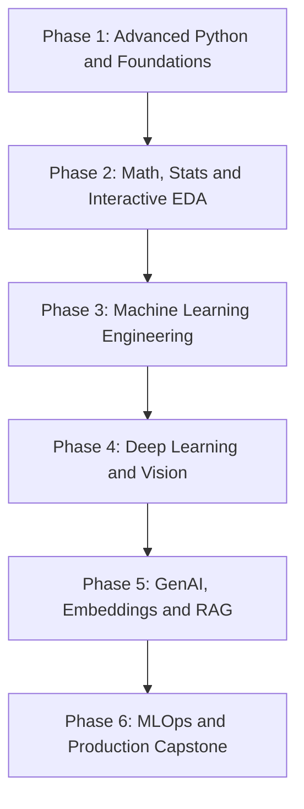

# Data Science Master Bootcamp (Zero-to-Hero Guide)

Welcome to the **Data Science Master Bootcamp Repository**. This course takes absolute beginners and non-programmers to job-ready Data Scientists, Machine Learning Engineers, and AI Practitioners.

It covers all 6 fundamental pillars of modern Data Science and Artificial Intelligence:
1. **Advanced Python and Data Foundations** (OOPs Classes, Inheritance, Dunder Methods, NumPy 2D Matrix Math, Memory Optimization)
2. **Mathematics, Statistics and Interactive EDA** (Linear Algebra, Gradient Descent Calculus, Probability Distributions, A/B Testing, Seaborn and Plotly Storytelling)
3. **Machine Learning Engineering** (Scikit-Learn, Linear/Ridge/Lasso Regression, Decision Trees, Random Forests, XGBoost, K-Means Clustering, PCA Dimensionality Reduction)
4. **Deep Learning and Neural Networks** (TensorFlow/Keras, Perceptrons, Backpropagation, CNNs for Vision, Medical Diagnostics)
5. **Modern AI, GenAI and LLM Fundamentals** (HuggingFace Embeddings, Tokenization, ChromaDB Vector DBs, RAG Pipeline Architecture)
6. **MLOps, Deployment and Production Capstone** (Model Serialization joblib, REST APIs using FastAPI, Streamlit Dashboard, Full-Stack Production Deployment)

---

## Visual Course Roadmap

---

## Quick Navigation and Master Blueprints

- **[Master Teaching Syllabus (Exhaustive Theory + Code Blueprint)](MASTER_TEACHING_SYLLABUS.md):** Exhaustive theory, definitions, features, uses in short bullet points, and line-by-line commented code for every topic.
- **[Data Science Teaching Plan](DATA_SCIENCE_TEACHING_PLAN.md):** Lecture-by-lecture breakdown with 4-part classroom formula for deep 2+ hour classes.
- **[Instructor's Maintenance Guide](INSTRUCTOR_GITHUB_GUIDE.md):** Classroom routine, Google Colab single-click integration, homework options, and Git workflow.

---

## Course Curriculum and Single-Click Interactive Colab Notebooks

### Phase 1: Advanced Python and Data Science Foundations
- **Lesson 1:** [Advanced Python OOPs, Classes and Generators](01-python-ds-foundations/01_advanced_python_oops.ipynb) 
  
- **Lesson 2:** [Vectorized NumPy Matrix Mathematics and Reshaping](01-python-ds-foundations/02_vectorized_numpy_matrices.ipynb) 
  

### Phase 2: Mathematics, Statistics and Interactive EDA
- **Lesson 1:** [Linear Algebra and Calculus for Machine Learning](02-math-stats-eda/01_linear_algebra_calculus_for_ml.ipynb) 
  
- **Lesson 2:** [Probability Distributions, Hypothesis and A/B Testing](02-math-stats-eda/02_probability_distributions_ab_testing.ipynb) 
  
- **Lesson 3:** [Seaborn and Plotly Interactive Storytelling and 5-Step EDA](02-math-stats-eda/03_seaborn_plotly_interactive_eda.ipynb) 
  

### Phase 3: Machine Learning Engineering
- **Lesson 1:** [Supervised Regression Models (Linear, Ridge, Lasso)](03-machine-learning-engineering/01_supervised_regression_models.ipynb) 
  
- **Lesson 2:** [Supervised Classification Models (Logistic, Decision Trees, XGBoost)](03-machine-learning-engineering/02_supervised_classification_models.ipynb) 
  
- **Lesson 3:** [Unsupervised Clustering (K-Means) and PCA Dimensionality Reduction](03-machine-learning-engineering/03_unsupervised_clustering_pca.ipynb) 
  

### Phase 4: Deep Learning and Neural Networks
- **Lesson 1:** [Artificial Neural Networks (ANN), Backpropagation and TensorFlow](04-deep-learning-neural-networks/01_artificial_neural_networks_tf.ipynb) 
  
- **Lesson 2:** [Convolutional Neural Networks (CNN) for Computer Vision](04-deep-learning-neural-networks/02_convolutional_neural_networks_vision.ipynb) 
  

### Phase 5: Modern AI, GenAI and LLM Fundamentals
- **Lesson 1:** [NLP Text Preprocessing, Embeddings and ChromaDB Vector DB](05-genai-llms-rag/01_nlp_embeddings_vector_db.ipynb) 
  
- **Lesson 2:** [Retrieval-Augmented Generation (RAG) Architecture](05-genai-llms-rag/02_rag_pipeline_streamlit_app.ipynb) 
  

### Phase 6: MLOps, Model Deployment and Production Capstone
- **Capstone Notebook:** [Full-Stack Production AI and MLOps Capstone](06-mlops-capstone/01_fullstack_ai_production_capstone.ipynb) 
  

---

## Sample Datasets

All practice datasets are available in the [`datasets/`](datasets/) folder:
- [`housing_prices.csv`](datasets/housing_prices.csv)
- [`customer_churn_ds.csv`](datasets/customer_churn_ds.csv)
- [`customer_reviews_nlp.csv`](datasets/customer_reviews_nlp.csv)
