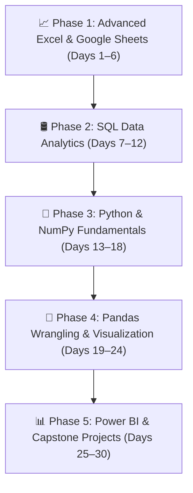

# 📊 30-Day Data Analytics Zero-to-Hero Bootcamp (Job-Ready Curriculum)

Welcome to the **Data Analytics Zero-to-Hero Repository**! This course is designed to take absolute beginners to job-ready Data Analysts in **30 Days (90 Hours Total, 3 Hours/Day)**.

It covers all 4 fundamental pillars of modern Data Analytics:
1. 📈 **Advanced Excel** (Formulas, XLOOKUP, Pivot Tables, Power Query, Google Sheets)
2. 🛢️ **SQL for Data Analytics** (Queries, Aggregations, Joins, Window Functions, SQLite)
3. 🐍 **Python & NumPy** (Variables, Control Flow, Functions, Vectorized Math)
4. 🐼 **Pandas, Seaborn & EDA** (Data Cleaning, GroupBy, Visual Storytelling, EDA)
5. 📊 **Power BI & Capstone Projects** (Star Schema, DAX Measures, Web Dashboards)

---

## 🗺️ Visual Course Roadmap

---

## 🚀 Quick Navigation & Master Blueprints

- 📘 **[Master Teaching Syllabus (3-Part Template Blueprint)](MASTER_TEACHING_SYLLABUS.md):** 100% exhaustive theory, simple English definitions, analogies, and line-by-line commented code for every topic!
- 🗓️ **[30-Day Teaching Plan (90 Hours Schedule)](30_DAY_TEACHING_PLAN.md):** Day-by-day (Days 1 to 30) and hour-by-hour (3 hours/day) teaching breakdown.
- 👨‍🏫 **[Instructor's Maintenance Guide](INSTRUCTOR_GITHUB_GUIDE.md):** Classroom routine, Google Colab & Sheets integration, and homework submission workflows.

---

## 📚 30-Day Course Curriculum & Interactive Lessons

### 📈 Phase 1: Advanced Excel for Data Analytics (Days 1 – 6)
- **Lesson 1:** [Excel Fundamentals, Referencing & Text Cleaning Guide](01-excel-analytics/01_excel_fundamentals_and_cleaning.md) 
  
- **Lesson 2:** [XLOOKUP, Pivot Tables & Power Query Guide](01-excel-analytics/02_excel_xlookup_pivots_powerquery.md) 
  

### 🛢️ Phase 2: SQL for Data Analytics (Days 7 – 12)
- **Lesson 1:** [SQL Queries, Filtering & Aggregations](02-sql-analytics/01_sql_queries_and_grouping.ipynb) 
  
- **Lesson 2:** [SQL Relational Joins & Window Functions](02-sql-analytics/02_sql_joins_and_window_functions.ipynb) 
  

### 🐍 Phase 3: Python & NumPy Fundamentals (Days 13 – 18)
- **Lesson 1:** [Python Basics, Control Flow & Loops](03-python-refresher/01_python_basics_and_control_flow.ipynb) 
  
- **Lesson 2:** [Data Structures (Lists, Dicts) & Functions](03-python-refresher/02_data_structures_and_functions.ipynb) 
  
- **Lesson 3:** [NumPy Array Operations & Vectorization](04-numpy-and-stats/01_numpy_arrays_and_vectorization.ipynb) 
  
- **Lesson 4:** [Business Statistics & IQR Outlier Detection](04-numpy-and-stats/02_statistics_and_outliers.ipynb) 
  

### 🐼 Phase 4: Pandas Wrangling, Visualization & EDA (Days 19 – 24)
- **Lesson 1:** [Pandas DataFrames, GitHub CSV Import & Filtering](05-pandas-wrangling/01_pandas_dataframes_and_filtering.ipynb) 
  
- **Lesson 2:** [Data Cleaning (Missing Values, Duplicates) & GroupBy](05-pandas-wrangling/02_data_cleaning_and_aggregations.ipynb) 
  
- **Lesson 3:** [Matplotlib & Seaborn Visual Storytelling](06-visualization-and-eda/01_matplotlib_seaborn_charts.ipynb) 
  
- **Lesson 4:** [End-to-End EDA Case Study on E-Commerce Dataset](06-visualization-and-eda/02_end_to_end_eda_case_study.ipynb) 
  

### 📊 Phase 5: Power BI & Capstone Projects (Days 25 – 30)
- **Guide:** [Power BI Star Schema, DAX & Live Web Publishing](07-powerbi-deepdive/01_powerbi_dax_and_web_publishing.md)
- **Capstone Project:** [End-to-End E-Commerce Analytics Capstone](08-capstone-projects/01_ecommerce_analytics_capstone.ipynb) 
  

---

## 📁 Sample Datasets

All practice datasets are available in the [`datasets/`](datasets/) folder:
- [`e_commerce_sales.csv`](datasets/e_commerce_sales.csv)
- [`student_performance.csv`](datasets/student_performance.csv)
- [`customer_churn.csv`](datasets/customer_churn.csv)
